==================================
1С Бухгалтерия - обновление
==================================

Проблема
========

В связи с изменениями законодательства РФ и другими юридическими требованиями возникает необходимость периодически выполнять обновление **1С Бухгалтерия**.

Обновление может затрагивать:

* конфигурацию 1С;
* платформу 1С;
* дополнительные обработки.

Решение
=======

Для обновления используется специализированное программное обеспечение, которое выполняет автоматизированное обновление баз 1С.

Самостоятельная установка обновлений вручную не выполняется.

Используется программа:

`Обновлятор 1С — групповое пакетное обновление всех баз за один раз <https://helpme1s.ru/obnovlyator-1s-gruppovoe-paketnoe-obnovlenie-vsex-baz-za-odin-raz>`_

Предварительные требования
==========================

Перед началом обновления необходимо выполнить следующие условия:

* никто не должен быть подключен к базе через клиент 1С (тонкий или толстый);
* необходимо иметь свободное время минимум 1-1,5 часа;
* проверить наличие рабочих резервных копий;
* иметь данные для подключения к 1С Конфигуратору от имени администратора.

Проверка активных пользователей
===============================

Для проверки активных подключений необходимо открыть:

::

   Администрирование → Обслуживание → Активные пользователи

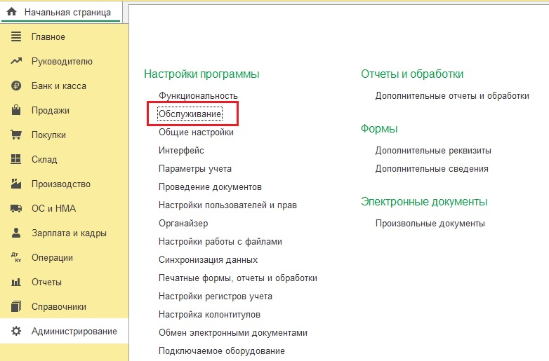

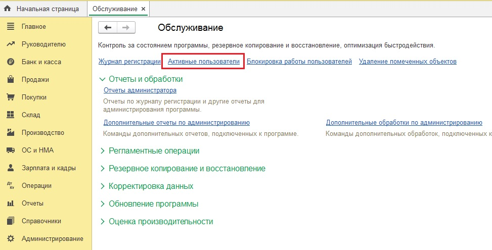

Почему требуется свободное время
================================

После обновления конфигурации 1С может выполнять длительную обработку данных.

Например, после изменения структуры документов данные могут быть преобразованы из старого формата в новый.

Время выполнения зависит от:

* мощности процессора сервера;
* скорости дисковой системы;
* количества данных в базе.

Проверка результата обновления
==============================

После обновления необходимо проверить результат выполнения:

::

   Администрирование → Интернет-поддержка и сервисы →
   Обновление версии программы →
   Результаты обновления и дополнительная обработка данных

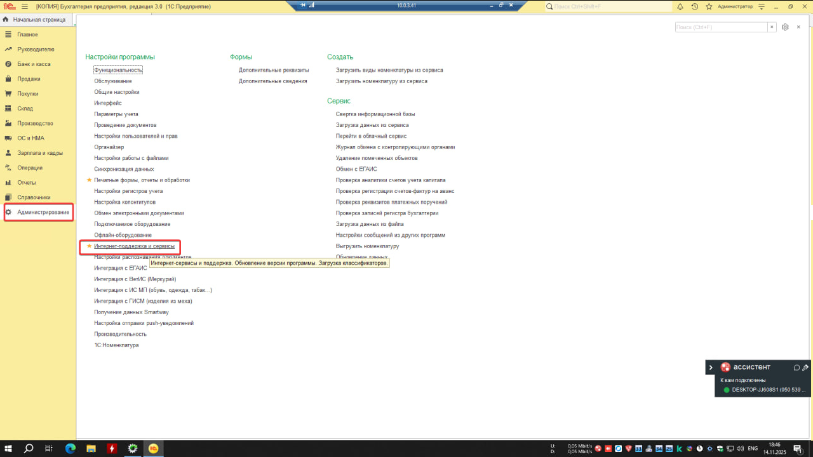

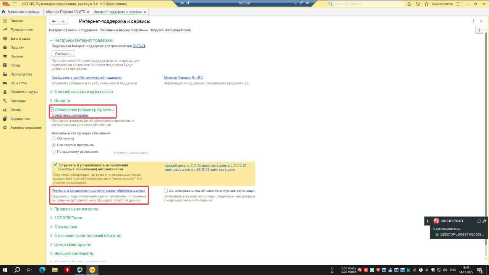

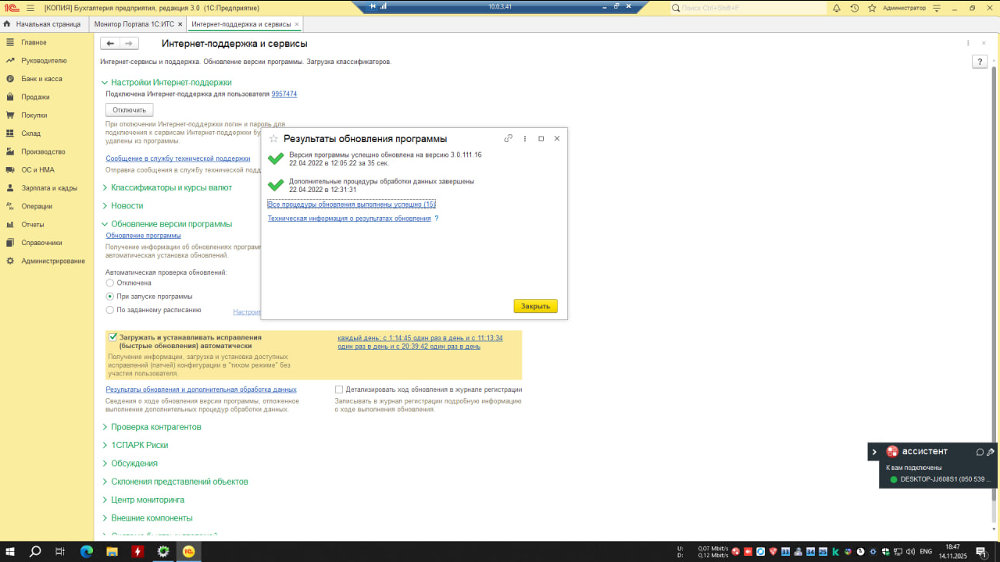

Если обновление завершилось успешно и ошибок нет, 1С Бухгалтерия готова к дальнейшей работе.

Проверка резервных копий
========================

Резервная копия конфигурации 1С
-------------------------------

Обновлятор 1С автоматически создает резервные копии конфигураций.

Путь хранения можно посмотреть:

::

   Настройки программы → Дополнительные настройки →
   Архивация баз → Куда

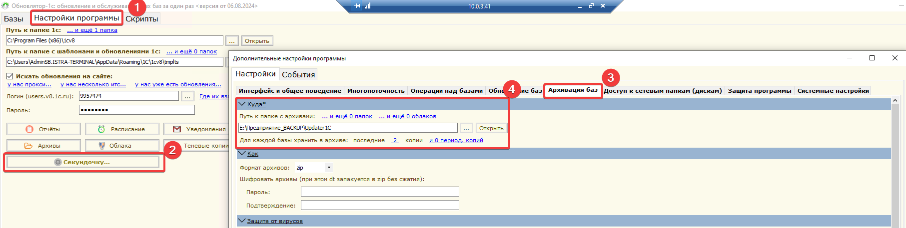

Проверка резервной копии СУБД
-----------------------------

Для проверки резервной копии СУБД необходимо получить доступ к файлам:

::

   .mdf
   .ldf

Для работы с файлами используется:

**SQL Server Management Studio (SSMS)**

Не подходят:

* JetBrains DataGrip;
* DBeaver.

Эти программы не умеют подключать файлы базы данных напрямую.

Подключение базы MSSQL
======================

Загрузите файлы базы данных на сервер с MSSQL.

В SSMS выполните подключение базы через:

::

   Databases → Attach

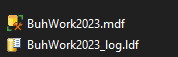

Подключение к серверу:

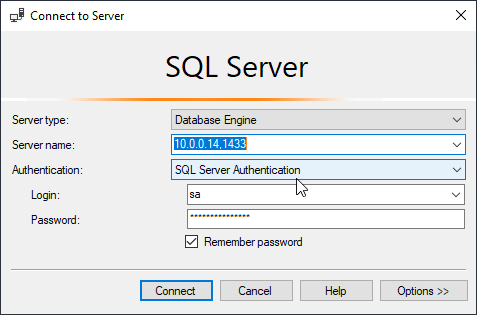

Выберите файл базы данных:

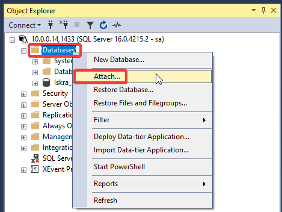

Добавьте файлы:

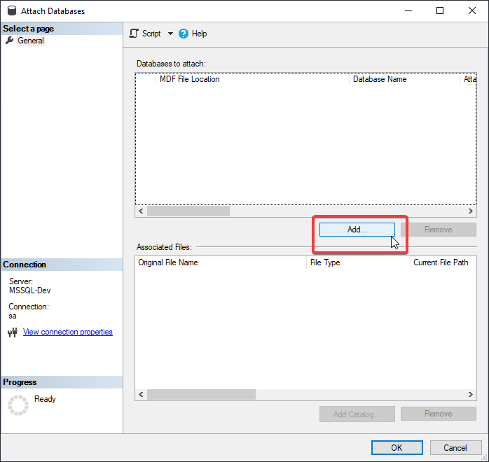

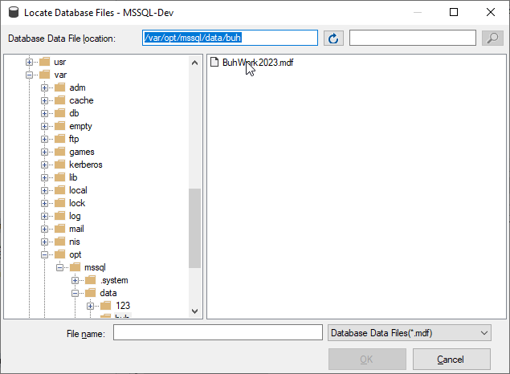

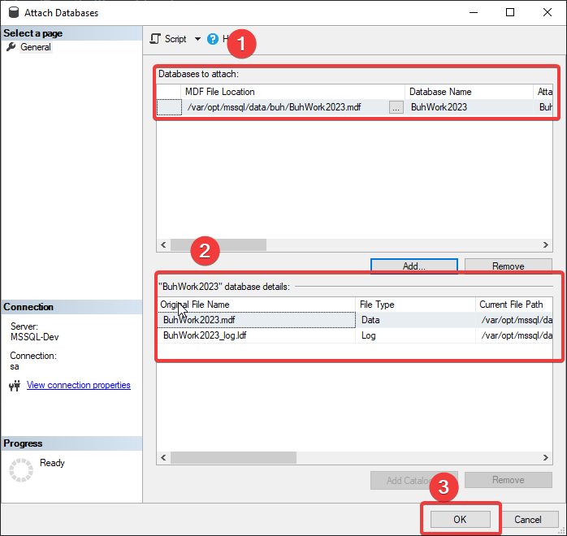

После успешного подключения в базе должны присутствовать таблицы 1С.

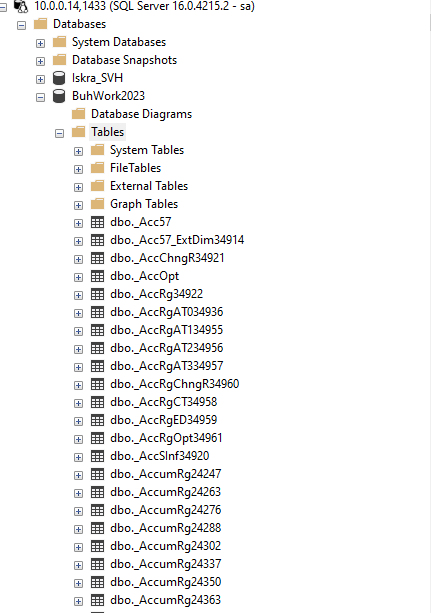

Если база подключилась пустой или произошла ошибка, необходимо проверить корректность резервного копирования.

Данные для подключения
======================

Данные доступа хранятся в:

::

   VaultWarden
   vw.it.local

Процесс обновления
==================

После выполнения всех проверок необходимо открыть обновлятор 1С.

Порядок действий:

1. Выбрать базу для обновления конфигурации.
2. Ввести данные подключения к СУБД.
3. Проверить подключение к 1С Конфигуратору.
4. Запустить обновление.
5. Контролировать процесс выполнения и отсутствие ошибок.

После завершения обновления проверить результат:

::

   Администрирование → Интернет-поддержка и сервисы →
   Обновление версии программы →
   Результаты обновления и дополнительная обработка данных

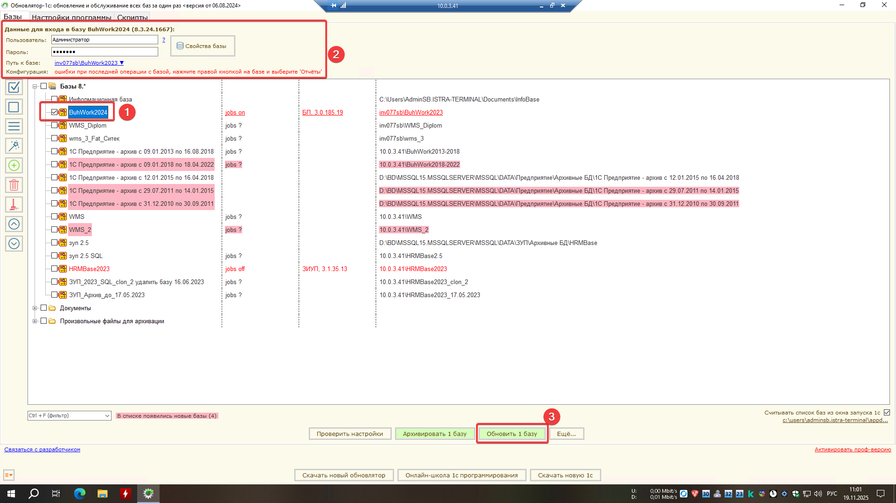

Конец инструкции.
