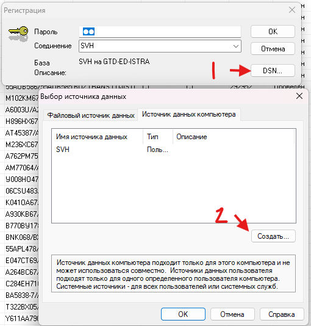
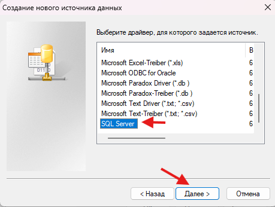
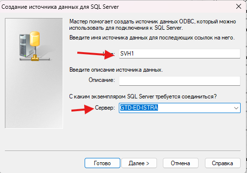
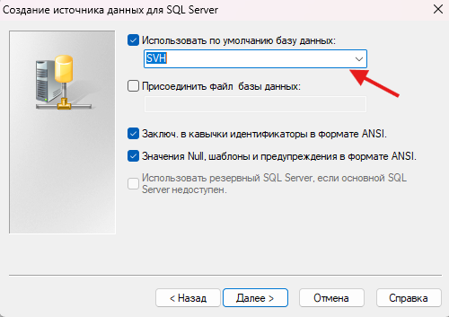

=========================
Установка Альта-СВХ
=========================

Данная инструкция описывает процесс поиска, распаковки и первоначальной настройки программы **Альта-СВХ**.

1. Поиск установочного архива
=============================

Установочные файлы Альта-СВХ находятся по сетевому пути:

::

   \\10.0.3.79\диспетчерская\АЛЬТА\!alta11.8.2

Перейдите по указанному пути и найдите архив с программой.

2. Распаковка архива
====================

1. Скопируйте архив с программой на локальный компьютер.
2. Распакуйте архив в удобное место.
3. После распаковки запустите установку программы.

3. Настройка установки
======================

При установке следуйте шагам по изображениям ниже.

Запуск установки:

Выбор SQL:

Выбор экземпляра:

Поменять с мастера:

После завершения настройки продолжите установку программы до окончания процесса.
