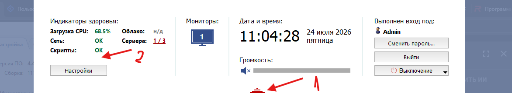
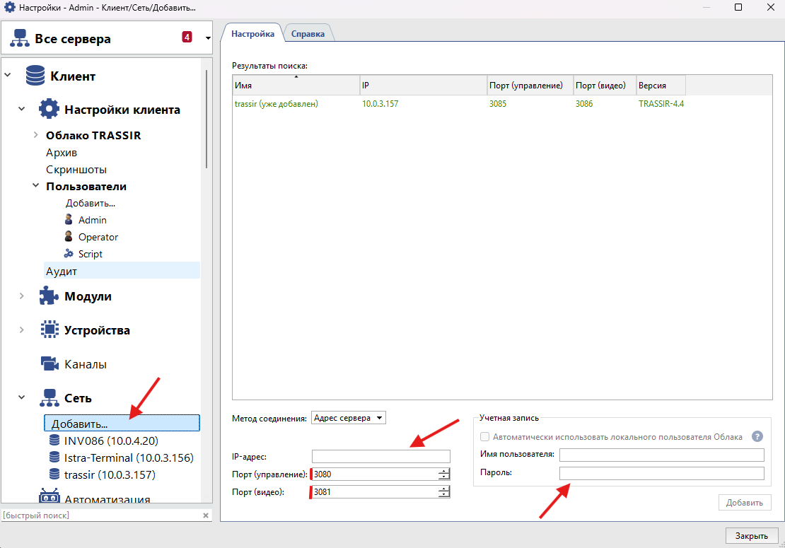
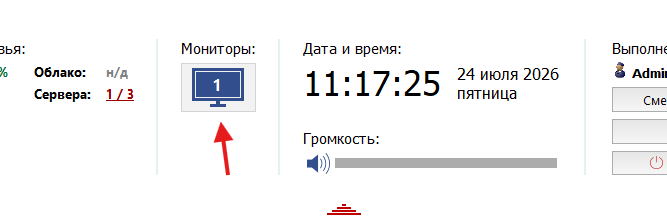

=================================
Просмотр камер через Trassir
=================================

Данная инструкция описывает процесс установки программы **Trassir**, настройки серверов и просмотра камер.

Установка и открытие программы
==============================

Установите программу **Trassir** и запустите её.

После открытия программы в верхней части экрана появятся **3 красные полоски** — это меню Trassir.

Нажмите на них для открытия основного окна программы.

Настройка серверов
==================

Для просмотра камер необходимо выполнить настройку подключения к серверам Trassir.

В открывшемся меню программы перейдите в раздел настройки серверов.

В системе используются три сервера с камерами, которые находятся под нашей ответственностью.

Сервер 1
--------

::

   IP: 10.0.4.20
   Порты: 3080/3081
   Login: admin
   Password: 3140Xyz!

Сервер 2
--------

::

   IP: 10.0.3.156
   Порты: 3080/3081
   Login: admin
   Password: 0511wer.Full_Pro!!!

Сервер 3
--------

::

   IP: 10.0.3.157
   Порты: 3085/3086
   Login: Admin
   Password: Tr13050tR!

Просмотр камер
==============

После добавления серверов для просмотра изображения необходимо открыть раздел:

::

   Монитор

После открытия монитора будут доступны подключенные камеры выбранного сервера.

Дополнительная информация
=========================

Если указанные данные для подключения не подходят, необходимо обратиться в Kaiten:

https://istra-terminal.kaiten.ru/space/210771/boards/card/35659934
