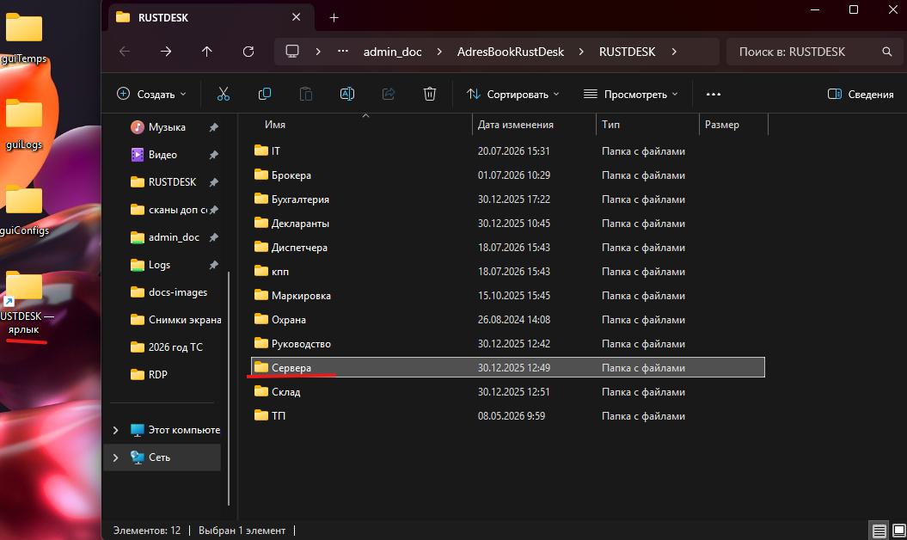
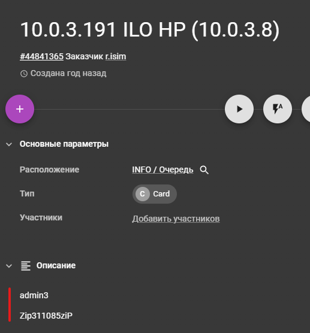
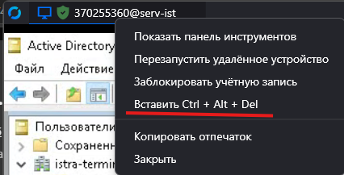
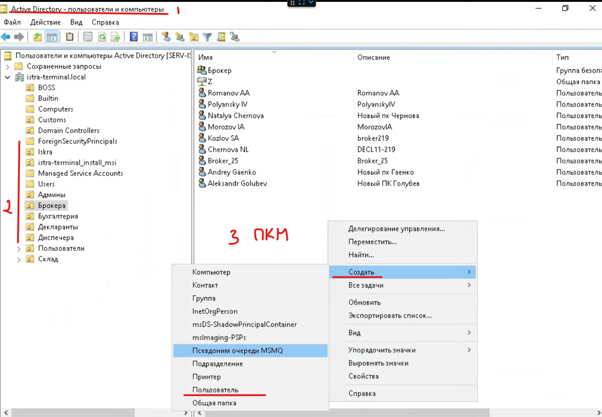
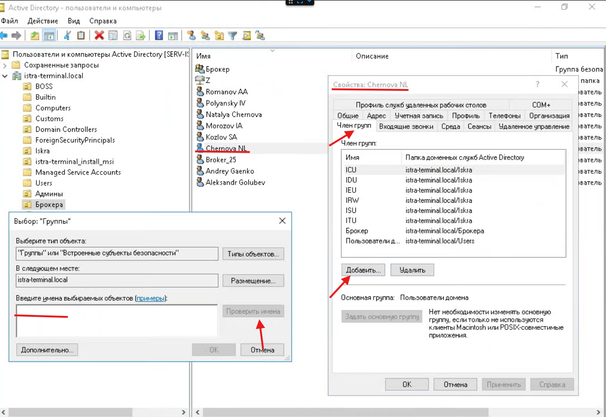
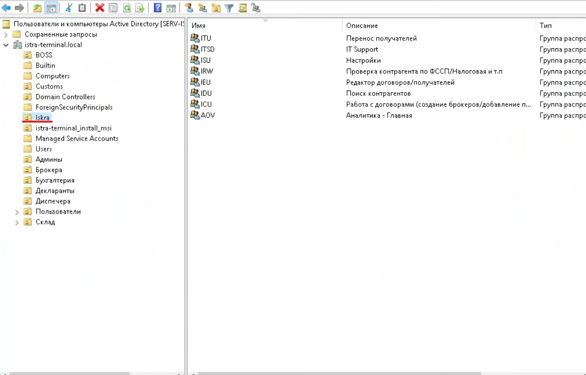
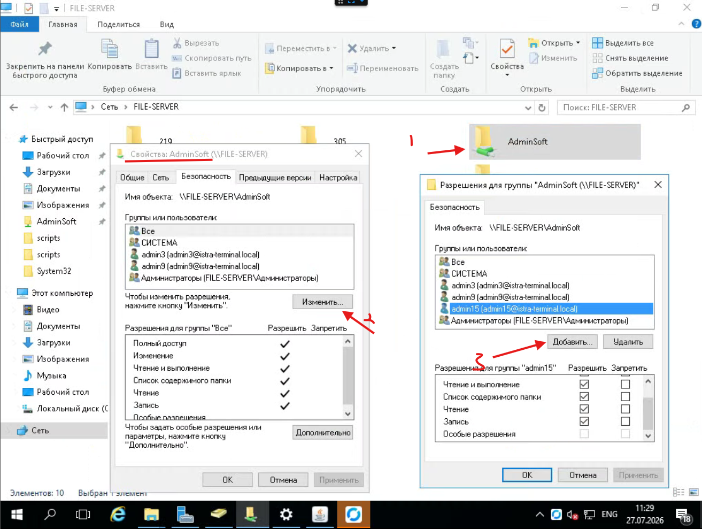

========================================
Работа с Active Directory
========================================

Данная инструкция описывает порядок подключения к контроллеру домена и основные операции по работе с Active Directory.

Подключение к контроллеру домена
================================

Контроллер домена расположен на сервере:

::

   10.0.3.8

Подключение выполняется через **RustDesk**.

В каталоге RustDesk откройте папку:

::

   Серверы

После этого выберите сервер **10.0.3.8** и подключитесь к нему.

Вход в систему
==============

Подключение к серверу необходимо выполнять **исключительно** под учетной записью:

::

   admin3

Если отображается экран блокировки Windows, необходимо отправить сочетание клавиш:

::

   Ctrl + Alt + Del

Для этого нажмите **правой кнопкой мыши** по вкладке сервера в окне RustDesk и выберите отправку комбинации клавиш.

Работа с Active Directory
=========================

После входа откройте оснастку:

::

   Пользователи и компьютеры Active Directory

Все пользователи размещаются в соответствующих организационных подразделениях (OU).

Создание нового пользователя
============================

Для создания нового пользователя:

1. Перейдите в необходимое подразделение (OU).
2. Нажмите правой кнопкой мыши.
3. Выберите:

::

   Создать → Пользователь

После этого заполните сведения о сотруднике и завершите создание учетной записи.

Добавление пользователя в группы
================================

После создания пользователя необходимо назначить ему необходимые группы безопасности.

Для этого откройте:

::

   Свойства → Член группы → Добавить

Помимо стандартных групп организации (например **Администратор**, **Бухгалтерия** и других), пользователю необходимо назначить группы системы **ISKRA**.

По умолчанию пользователю назначаются **все группы ISKRA**, если для него не предусмотрены исключения.

Предоставление доступа к сетевым папкам
=======================================

Для выдачи пользователю доступа к сетевой папке:

1. Откройте свойства папки.
2. Перейдите на вкладку:

::

   Безопасность

3. Нажмите:

::

   Изменить → Добавить

4. Выберите пользователя или группу Active Directory.
5. Назначьте необходимые права доступа и сохраните изменения.

После выполнения указанных действий пользователь сможет пройти авторизацию в домене, получит необходимые группы безопасности и доступ к сетевым ресурсам в соответствии с назначенными разрешениями.
