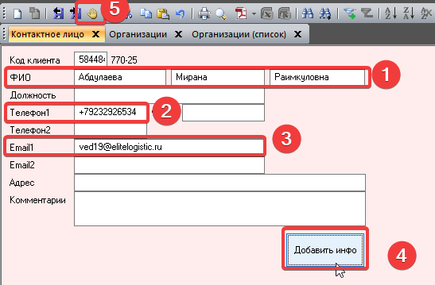

==================================
Личный кабинет верификация | Добавление допника
==================================

Данная инструкция описывает процесс переноса данных контрагента (Допник) из внешнего файла в систему **Альта-СВХ**.

1. Откройте файл, полученный от брокера, и запустите программу **Альта-СВХ**.

2. В главном меню программы перейдите по пути:
   **Файл → Справочник → Организации (Список)**.
   Откроется окно со списком всех организаций.

3. Найдите нужного брокера в списке.
   Для быстрого поиска введите **номер договора** в поле ввода "Название" (или воспользуйтесь поиском по наименованию).

4. Дважды щелкните левой кнопкой мыши по найденной записи, чтобы открыть карточку организации.

5. **Заполнение ИНН:**
   Переключитесь на файл от брокера (Допник), скопируйте **ИНН** контрагента.
   Вернитесь в карточку организации в Альте.
   Нажмите **F11** для перехода в режим редактирования, вставьте скопированный ИНН в соответствующее поле.
   Нажмите **F9** для сохранения изменений в карточке.

6. **Добавление контактных данных:**
   После сохранения ИНН, в нижней части окна карточки организации перейдите на вкладку **Контактные лица**.

7. Нажмите **F11**, чтобы создать новую запись о контактном лице.
   Заполните поля:
      * **ФИО:** Скопируйте из файла брокера.
      * **Телефон 1:** Скопируйте номер телефона. 
      * **Почта 1:** Скопируйте адрес электронной почты.
.. note::
   Телефон обязательно указывать с плюсом. Email должен быть корректным

Нажмите **F9** для сохранения созданной записи контактного лица.

8. При необходимости, повторите шаг 7 для добавления дополнительных контактных лиц (если в файле брокера указано несколько человек).
9. Скачать допник и загрузить в папку со сканами. Путь **\\10.0.3.79\Firms\сканы доп соглашение**
Файл переименовать как номер договора и название компании.

.. note::
   Если номер договора отсутствует в списке организаций Альта-СВХ, необходимо создать новую запись.

   Порядок создания нового договора:

   1. В окне списка организаций выберите любой существующий договор.
   2. Нажмите **F7** для создания новой записи.
   3. Заполните поля:
      
      * **Название:** укажите номер договора из допника.
      * **Код страны:** укажите код России — **643**.
      * **ИНН:** укажите ИНН из допника.

   4. Нажмите **F9** для сохранения новой записи.

   После создания организации продолжите работу по инструкции:
   
   * перейдите во вкладку **Контактные лица**;
   * создайте новое контактное лицо (или несколько, если указано несколько контактов в допнике);
   * заполните ФИО, телефон и электронную почту;
   * нажмите **F9** для сохранения.

   Важно:
   
   * **F7** — создать новую запись.
   * **F8** — удалить запись.
   * **F9** — сохранить изменения.
   * **F11** — перейти в режим редактирования / откатить изменения.
