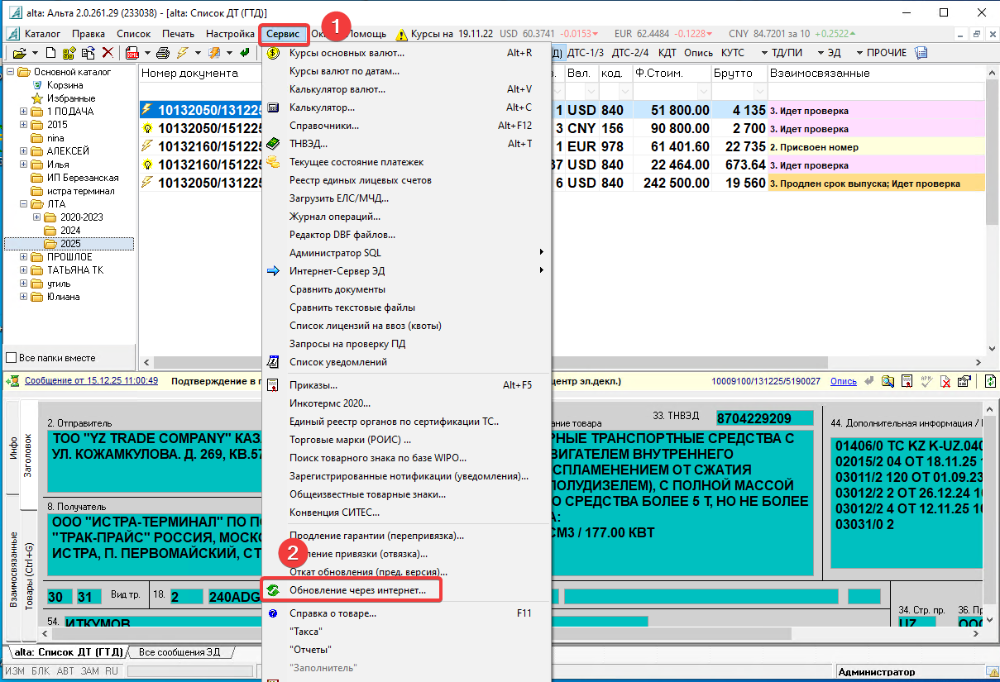
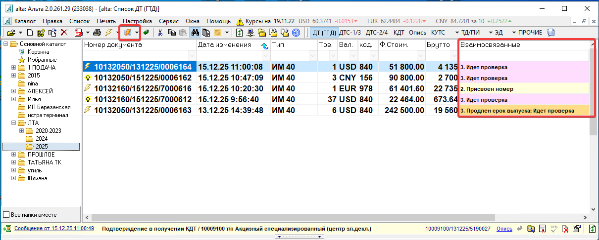

=================================
Обновление Альта ГТД
=================================

Данная инструкция описывает процесс ежедневного обновления программы **Альта ГТД**.

Проблема
========

Каждый день необходимо выполнять обновление Альта ГТД на сервере:

::

   10.0.3.105

Обновление необходимо выполнять регулярно, так как:

* таможенные органы ежедневно выпускают изменения;
* обновляются данные и настройки программы;
* необходимо получать актуальные курсы валют от Центрального Банка РФ.

Решение
=======

Для выполнения обновления необходимо подключиться к серверу:

::

   10.0.3.105

После подключения открыть программу **Альта ГТД**.

Обновление через интернет
=========================

В программе Альта ГТД перейти в меню:

::

   Сервис → Обновление через интернет

Запустить процесс обновления и дождаться его завершения.

Проверка работоспособности
==========================

После завершения обновления необходимо проверить корректность взаимодействия с серверами декларирования грузов.

Выполнить проверку соединения и убедиться, что связь с серверами работает корректно.

После успешной проверки обновление Альта ГТД считается выполненным.
