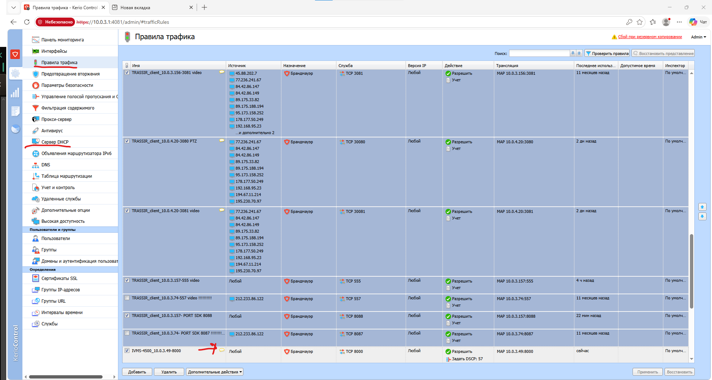

=================================
Администрирование Kerio Control
=================================

Данная инструкция описывает подключение к веб-интерфейсу **Kerio Control** и основные разделы, используемые при администрировании.

Подключение к Kerio Control
===========================

Сервер **Kerio Control** установлен на отдельном сервере инфраструктуры.

IP-адрес сервера:

::

   10.0.3.1

Веб-интерфейс доступен по адресу:

::

   http://10.0.3.1:4081/admin/login

Для входа используйте следующие учетные данные:

::

   Логин: admin
   Пароль: Zip311085ziP

После успешной авторизации откроется панель управления Kerio Control.

Правила трафика
===============

Для просмотра и редактирования правил перейдите в раздел:

::

   Правила трафика

В данном разделе отображаются все действующие правила маршрутизации и фильтрации трафика.

Приоритет правил определяется их расположением:

* чем выше расположено правило, тем выше его приоритет;
* нижестоящие правила применяются только в случае, если не сработали вышестоящие.

Каждое правило может содержать комментарий.

Для просмотра комментария достаточно навести курсор мыши на соответствующее правило.

DHCP
====

В Kerio Control также настроен DHCP-сервер.

В разделе DHCP содержатся IP-адреса устройств компании и сведения о выданных адресах.

Через данный раздел можно просматривать назначенные IP-адреса и информацию об устройствах сети.
