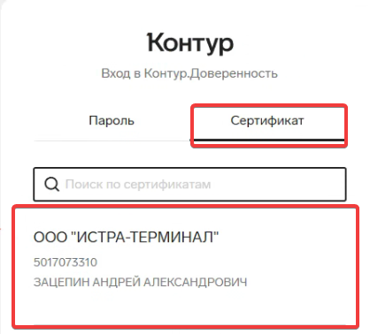
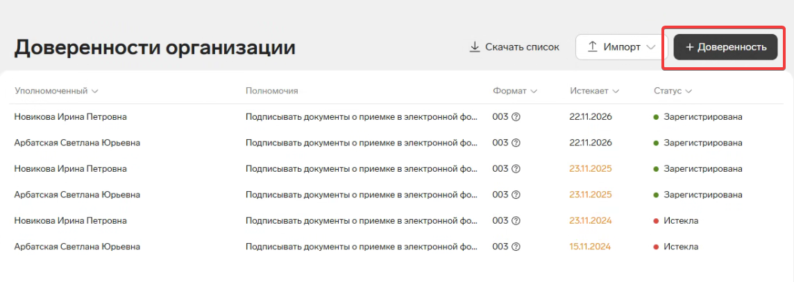
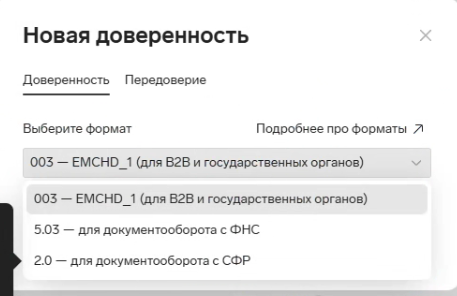
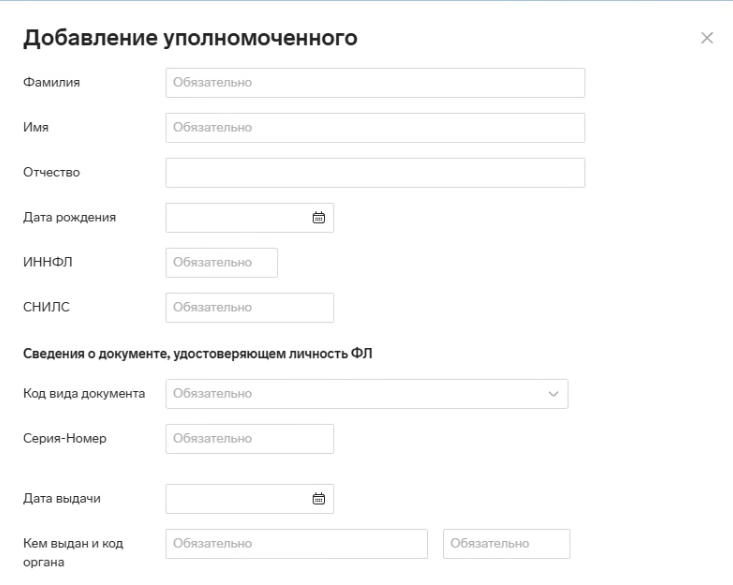
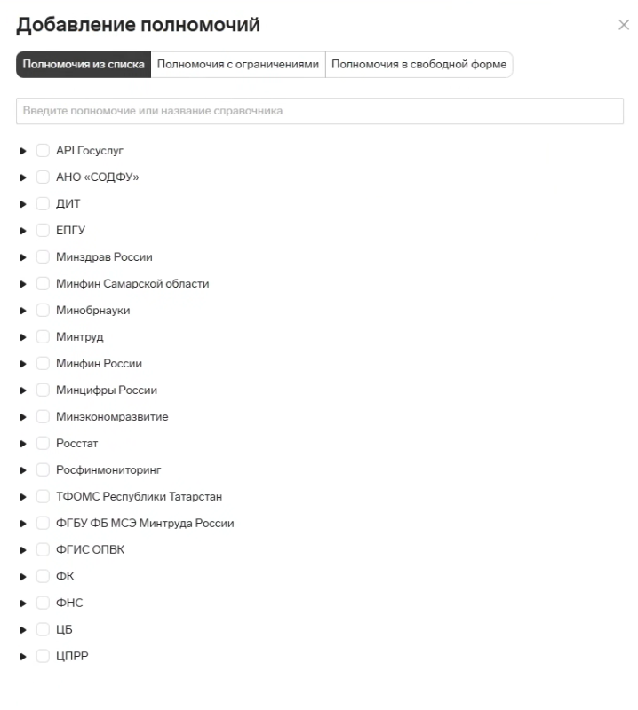

=================================
Перевыпуск МЧД (машиночитаемой доверенности)
=================================

Данная инструкция описывает процесс выпуска и перевыпуска **МЧД (машиночитаемой доверенности)** через сервис **Контур.Доверенность**.

Проблема
========

В связи с:

* окончанием срока действия МЧД;
* изменением полномочий сотрудника;
* изменением требований организации;
* другими причинами,

необходимо выполнить выпуск новой машиночитаемой доверенности.

МЧД используется для работы:

* в **1С Бухгалтерии**;
* в **Контур.Диадок**.

Решение
=======

Для выпуска МЧД используется сервис:

https://kontur.ru/mchd

Через сервис **Контур.Доверенность** можно выпускать необходимое количество доверенностей.

Стоимость использования сервиса:

::

   14250 рублей в год

Также возможен выпуск МЧД через сайт ФНС без использования сервиса Контур.

Для этого необходимо знать корректные **коды полномочий**, которые можно уточнить у ответственного сотрудника.

Вход в Контур.Доверенность
==========================

Перейдите на сайт:

https://kontur.ru/mchd

Выполните вход с помощью ЭЦП организации.

Вход необходимо выполнять от имени:

::

   Генерального директора

Создание доверенности
=====================

После входа необходимо создать новую доверенность.

Выбор формата МЧД
=================

Выберите необходимый формат доверенности в зависимости от требований организации.

В нашей работе используется формат:

::

   003

Данный формат необходим для обмена по модели:

::

   B2B

Заполнение данных доверенности
==============================

В форме создания доверенности необходимо указать:

* область применения;
* срок действия;
* возможность создания передоверенности.

Рекомендуемый срок действия:

::

   1 год

Передоверие означает возможность уполномоченного сотрудника передать свои полномочия другому лицу.

.. note::
   Возможность передоверия может потребовать нотариального заверения.

Добавление уполномоченного лица
===============================

После заполнения основной информации необходимо добавить:

* уполномоченного сотрудника;
* либо юридическое лицо.

Выбор полномочий
================

После добавления сотрудника необходимо назначить необходимые полномочия.

Коды полномочий уточняются у главного бухгалтера.

Выпуск МЧД
==========

После заполнения всех данных отправьте доверенность на выпуск.

Обычно выпуск занимает:

::

   до 15 минут

После успешного выпуска необходимо скачать архив с МЧД.

В архиве должны находиться два файла:

::

   .xml
   .sig

Файл **.xml** содержит информацию о МЧД.

Файл **.sig** содержит электронную подпись МЧД.

После получения файлов МЧД готова к использованию в 1С Бухгалтерии и Контур.Диадок.
