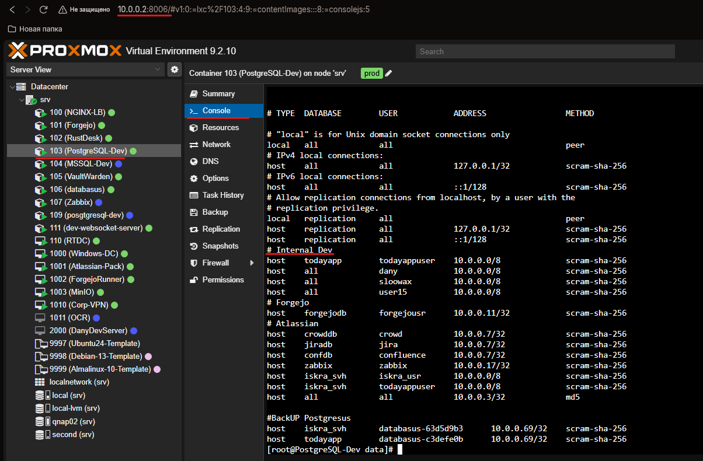

=================================
Подключение к PostgreSQL через pgAdmin4
=======================================

Данная инструкция описывает проверку конфигурации PostgreSQL на сервере и подключение к базе данных через **pgAdmin4**.

# Проверка конфигурации PostgreSQL

Для проверки конфигурации необходимо подключиться к серверу PostgreSQL (**prod**) через **Proxmox**.

В Proxmox найдите сервер:

::

103

Откройте:

::

Console

Для входа используйте:

::

Username: root
Password: 3bW7I9g3E6q6

Расположение конфигурационных файлов PostgreSQL:

::

/var/lib/pgsql/18/data

# Проверка pg_hba.conf

Основной файл, который необходимо проверить для подключения пользователей, — `pg_hba.conf`.

Для просмотра файла выполните:

::

cat /var/lib/pgsql/18/data/pg_hba.conf

В файле найдите раздел:

::

# Internal Dev

В этом разделе должна присутствовать учетная запись, которая будет использоваться для подключения через pgAdmin4.

:alt: Конфигурация pg_hba.conf
:align: center
:width: 700px

# Создание пользователя PostgreSQL

Учетная запись создается пользователем, у которого уже есть доступ к PostgreSQL.

Для создания пользователя выполните SQL-команду:

::

CREATE ROLE pgadmin_user
WITH LOGIN
PASSWORD 'СложныйПароль'
SUPERUSER;

Вместо `СложныйПароль` необходимо указать пароль, который будет использоваться для подключения через pgAdmin4.

# Добавление пользователя в pg_hba.conf

После создания пользователя необходимо добавить соответствующее правило в файл `pg_hba.conf`:

::

host    all    pgadmin_user    10.0.0.0/8    scram-sha-256

После изменения файла необходимо применить новую конфигурацию PostgreSQL.

Для этого выполните:

::

SELECT pg_reload_conf();

После успешного выполнения PostgreSQL перечитает конфигурацию без полной перезагрузки сервера.

# Подключение через pgAdmin4

Для подключения к удаленному PostgreSQL не требуется устанавливать PostgreSQL на локальный компьютер.

Достаточно установить **pgAdmin4**.

## Регистрация сервера

Откройте pgAdmin4 и зарегистрируйте новый сервер.

При настройке подключения укажите параметры сервера PostgreSQL.

В разделе:

::

Connection

необходимо указать данные для подключения, предусмотренные на сервере:

* адрес удаленного сервера;
* порт PostgreSQL;
* имя базы данных;
* имя пользователя;
* пароль пользователя.

В качестве пользователя укажите созданную учетную запись, например:

::

Username: pgadmin_user
Password: пароль, указанный при создании пользователя

После заполнения параметров нажмите:

::

Save

Если параметры указаны правильно и правило для пользователя присутствует в `pg_hba.conf`, pgAdmin4 установит подключение к PostgreSQL.
