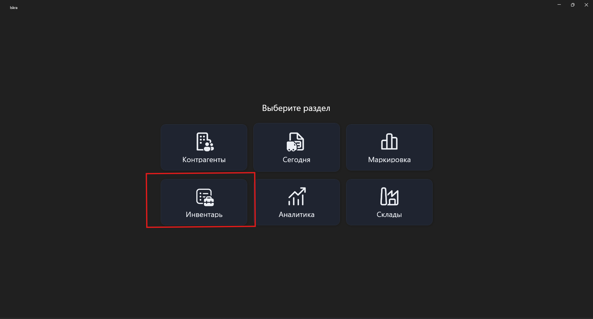
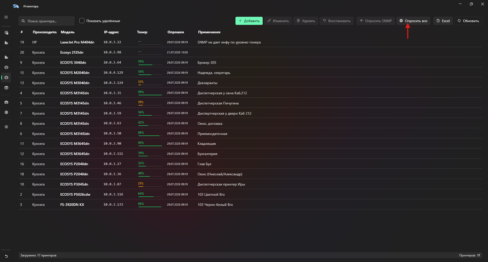
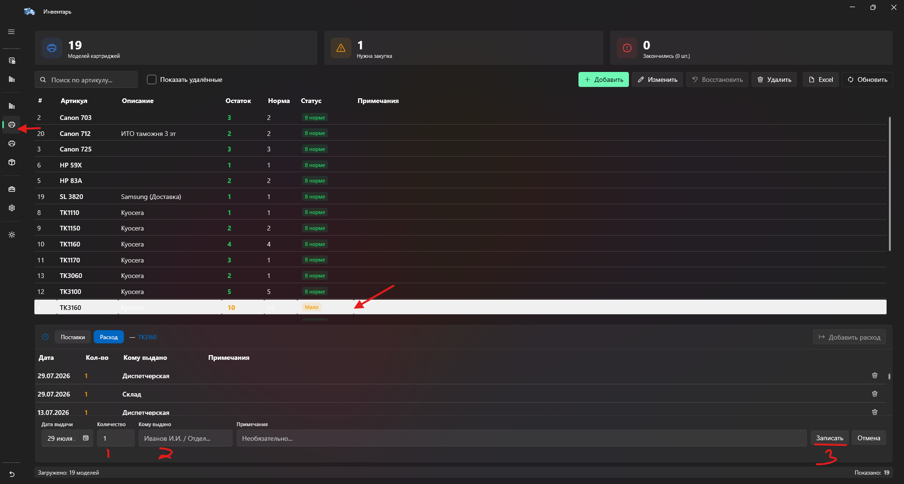

=================================
Замена картриджей в принтерах
=================================

Данная инструкция описывает процесс замены картриджей в принтерах, проверки уровня тонера и внесения изменений в систему **Искра**.

Учет картриджей
===============

Учет состояния принтеров и расхода картриджей ведется в системе **Искра**.

Данные об уровне тонера в принтерах передаются автоматически через протокол:

::

   SNMP

Перед заменой картриджа необходимо выполнить проверку текущего уровня тонера.

Проверка уровня тонера на принтерах Kyocera
===========================================

Для получения информации об уровне тонера необходимо распечатать отчет состояния принтера.

На панели управления Kyocera выполнить следующие действия:

::

   Системное меню/Счетчик
        ↓
   ▲ ▼ → Отчет
        ↓
   OK
        ↓
   ▲ ▼ → Печать отчета
        ↓
   OK
        ↓
   ▲ ▼ → Стр. состояния
        ↓
   OK
        ↓
   Да

Проверку уровня тонера необходимо выполнять:

* до замены картриджа;
* после замены картриджа.

Это необходимо для подтверждения корректной замены и обновления данных.

Замена картриджа
================

После проверки уровня тонера выполните замену картриджа в принтере.

Важно:

* использованные картриджи не выбрасывать;
* все старые картриджи отправляются на перезаправку.

После установки нового картриджа необходимо обновить информацию в системе **Искра**.

Обновление данных в Искре
=========================

После замены картриджа необходимо получить актуальные данные от принтеров.

Перейдите в раздел:

::

   Инвентарь → Принтеры с уровнем тона

Нажмите кнопку:

::

   Опросить всё

После выполнения опроса система получит новые данные об уровне тонера в принтерах.

Учет расхода картриджей
=======================

После замены картриджа необходимо дополнительно зафиксировать расход в разделе учета количества картриджей.

Перейдите во вкладку учета картриджей.

Порядок действий:

1. Выберите необходимую модель картриджа.
2. Добавьте расход.
3. Укажите количество использованных картриджей.
4. В комментарии укажите место замены картриджа.

Пример комментария:

::

   Диспетчерская

Комментарий должен содержать фактическое место, где была произведена замена картриджа.

После выполнения всех действий:

* картридж заменен;
* данные о тонере обновлены через SNMP;
* расход картриджа отражен в Искре;
* старый картридж подготовлен для отправки на перезаправку.
