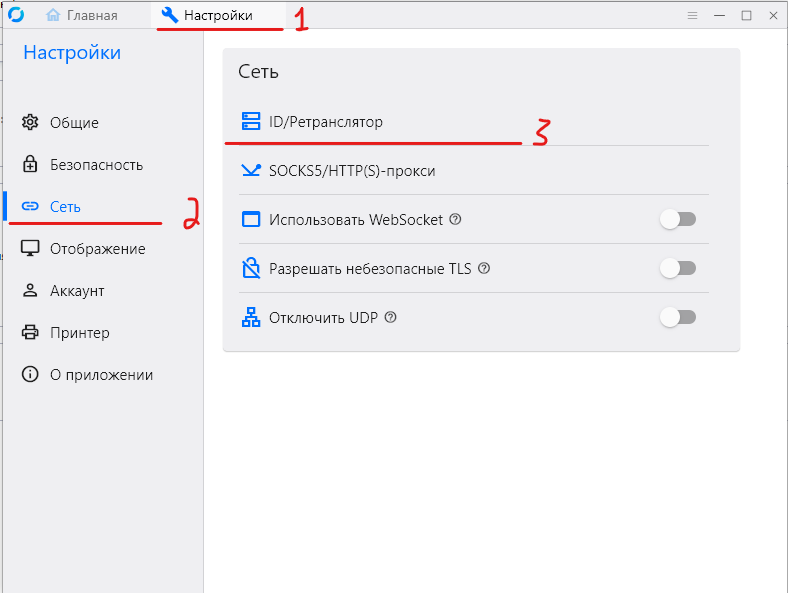
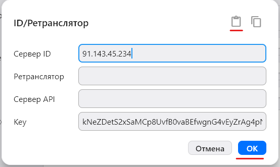
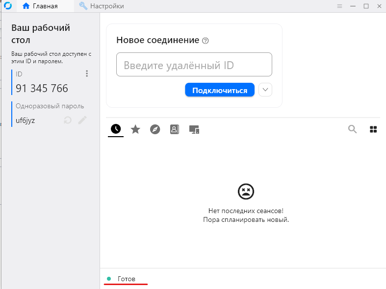

=================================
Подключение к внутреннему серверу RustDesk
=================================

Данная инструкция описывает настройку клиента **RustDesk** для подключения к внутреннему серверу организации.

Установка клиента
=================

Для работы с RustDesk необходимо скачать и установить клиент **RustDesk**.

Важно: одной установки клиента недостаточно. Для работы необходимо настроить подключение к внутреннему серверу RustDesk.

Получение конфигурации
======================

Конфигурация внутреннего сервера находится по сетевому пути:

::

   \\10.0.3.79\AdminSoft\2.txt

Откройте файл ``2.txt`` и скопируйте конфигурацию в буфер обмена.

Конфигурация имеет следующий вид:

::

   ==Qfi0TWo5Ec0cWQypVeFZHNH52Z3ZWRCFmdwIkZ2VFOwNUThNFeyMFdlRkWl50aiojI5V2aiwiIiojIpBXYiwiIiojI5FGblJnIsICNzIjL1QjLzQTMuETOiojI0N3boJye

Настройка клиента RustDesk
==========================

Откройте установленный клиент **RustDesk**.

Перейдите в:

::

   Настройки → Сеть → ID/Ретранслятор

В разделе настройки нажмите кнопку **Clipper** для вставки конфигурации из буфера обмена.

После вставки конфигурации проверьте, что настройки применились.

Проверка подключения
====================

После применения конфигурации вернитесь на главную панель клиента RustDesk.

При успешном подключении к внутреннему серверу в статусе должно отображаться:

::

   Готов

Если отображается статус **«Готов»**, клиент RustDesk успешно подключен к внутренней инфраструктуре и готов к работе.
