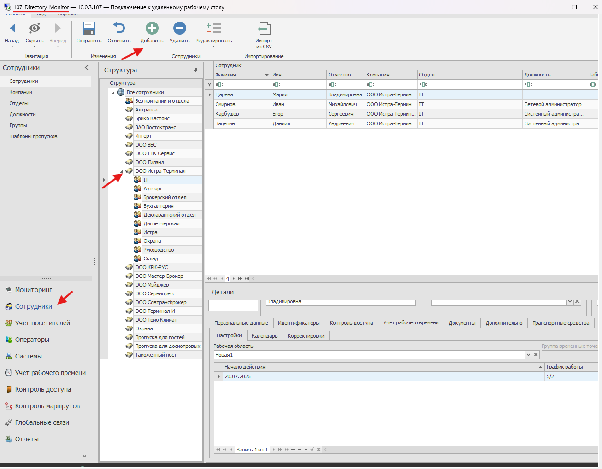
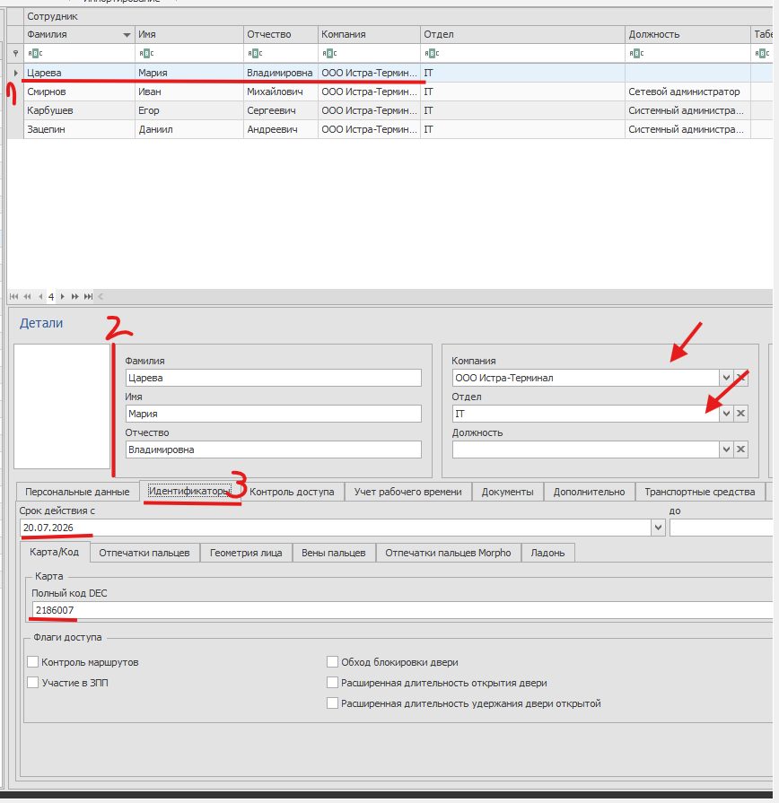
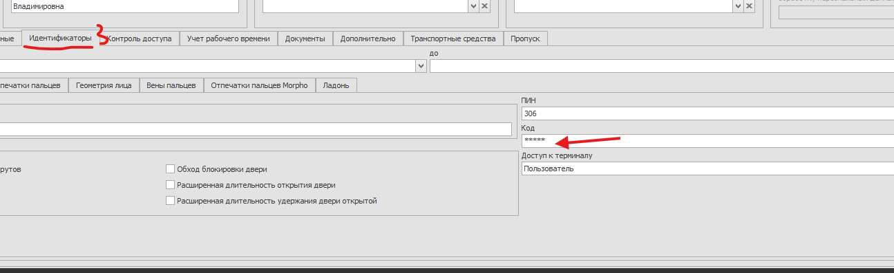
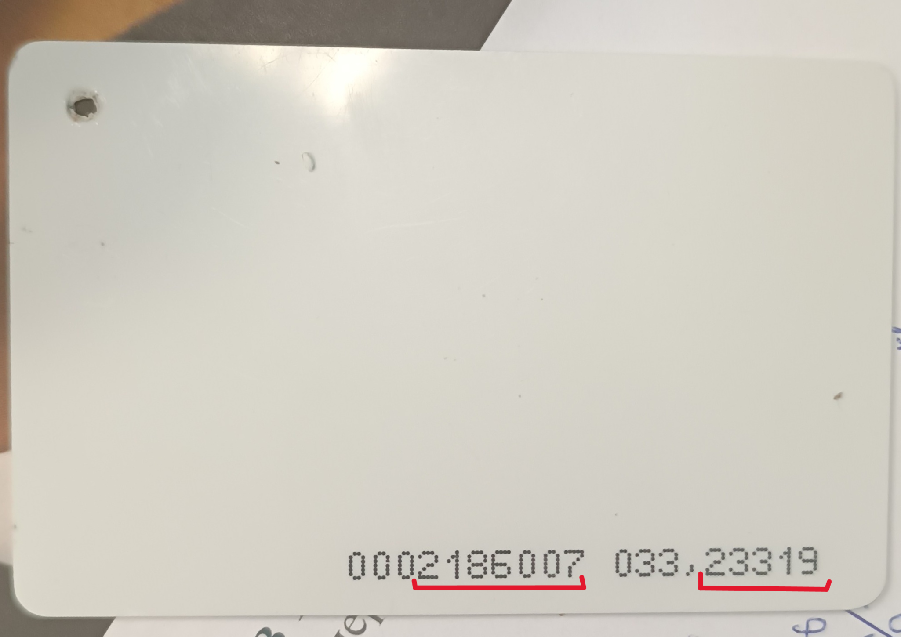
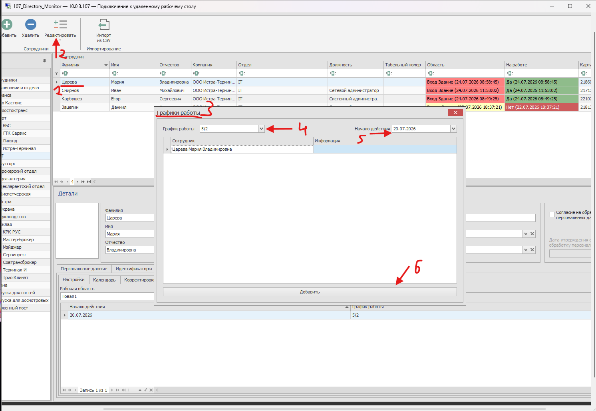

=================================
Выписка пропусков в Timex
=================================

Данная инструкция описывает процесс создания сотрудника, назначения карты доступа и настройки рабочего графика в системе **Timex**.

Подключение к серверу Timex
============================

Для работы с системой Timex необходимо подключиться к удаленному серверу.

Программа Timex находится на сервере:

::

   10.0.3.107

Подключение выполняется через RDP.

В папке RDP найдите соответствующее подключение и откройте его.

Данные для подключения:

::

   Логин: Directory_Monitor
   Пароль: 3140xyz1

После успешного подключения программа **Timex** будет автоматически открыта.

Создание пользователя и назначение карточки
============================================

Для создания нового сотрудника необходимо перейти в раздел:

::

   Пользователи

Создайте нового пользователя в соответствующей вкладке.

Заполните информацию о сотруднике:

* ФИО;
* необходимые данные сотрудника;
* дополнительные поля согласно требованиям системы.

После создания пользователя необходимо перейти во вкладку:

::

   Идентификаторы

В данном разделе необходимо указать:

* номер карты;
* код карты.

Номер карты и код указаны на физической карте сотрудника.

Настройка рабочего графика сотрудника
=====================================

После создания пользователя необходимо назначить ему рабочий график.

Перейдите в раздел:

::

   Учет рабочего времени

Создайте новую рабочую область.

Укажите:

* начало действия;
* необходимый график работы.

После выбора сотрудника выполните:

::

   Редактировать → Графики работы

Укажите:

* рабочий график сотрудника;
* дату начала действия графика.

После сохранения сотрудник будет создан в системе Timex, карта доступа назначена, а рабочий график применен.
